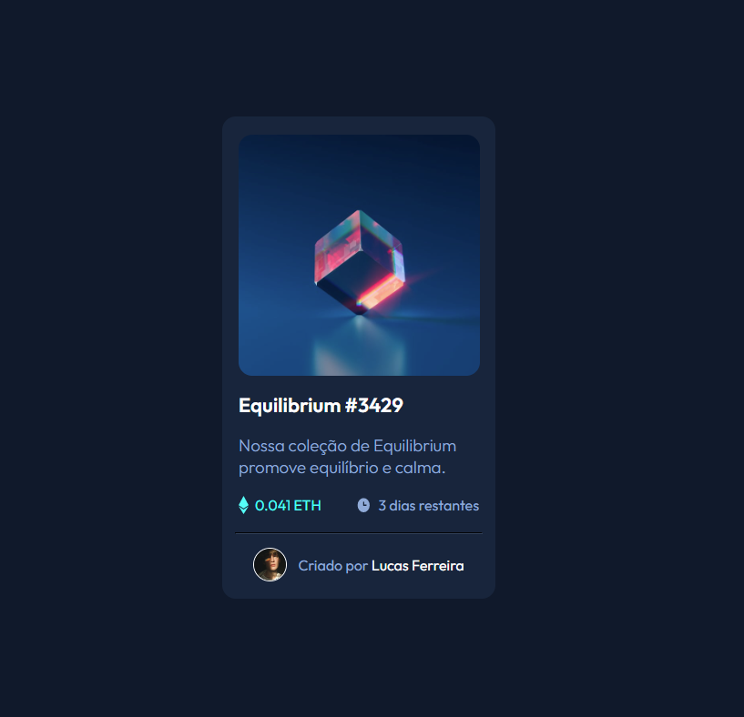
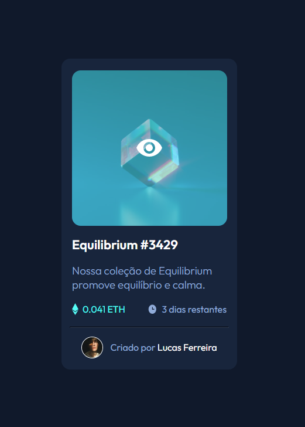
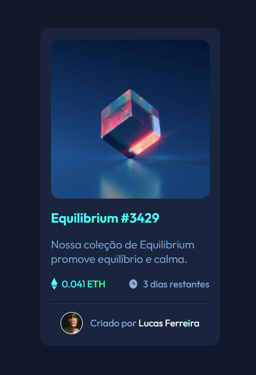
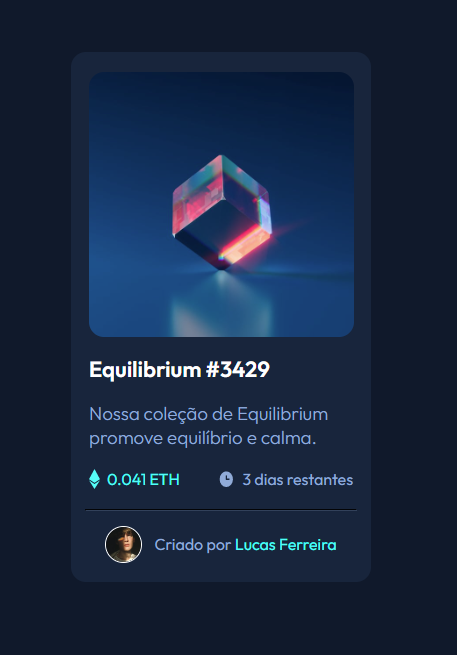

# Frontend Mentor - NFT preview card component solution

This is a solution to the [NFT preview card component challenge on Frontend Mentor](https://www.frontendmentor.io/challenges/nft-preview-card-component-SbdUL_w0U). Frontend Mentor challenges help you improve your coding skills by building realistic projects. 

## Table of contents

- [Overview](#overview)
  - [The challenge](#the-challenge)
  - [Screenshot](#screenshot)
  - [Links](#links)
- [My process](#my-process)
  - [Built with](#built-with)
  - [What I learned](#what-i-learned)
  - [Continued development](#continued-development)
- [Author](#author)

## Overview

### The challenge

Users should be able to:

- View the optimal layout depending on their device's screen size
- See hover states for interactive elements

### Screenshots






### Links

- Solution URL: [Add solution URL here](https://your-solution-url.com)
- Live Site URL: [Add live site URL here](https://your-live-site-url.com)

## My process

### Built with

- Semantic HTML5 markup
- CSS custom properties
- Flexbox

### What I learned

I learned how to set a hover state in CSS with this project

```css
h1:hover, span:hover {
    color: hsl(178, 100%, 50%);
    cursor: pointer;
}

.imagem-hover {
    display: flex;
    position: absolute;
    object-fit: cover;
    width: 265px;
    height: 265px;
    margin-top: 20px;
    max-width: 100%;
    border-radius: 15px;
    background-color: rgba(0, 255, 255, 0.5);
    z-index: 5;
    opacity: 0;
    justify-content: center;
    align-items: center;
}

.imagem-hover:hover {
    cursor: pointer;
    visibility: visible;
    opacity: 1;
}
```

### Continued development

I want to keep practicing how to use hover and :after/:before


## Author

- Frontend Mentor - [@lucasjanta](https://www.frontendmentor.io/profile/lucasjanta)
- Twitter - [@lucasjanta](https://www.twitter.com/lucasjanta)
